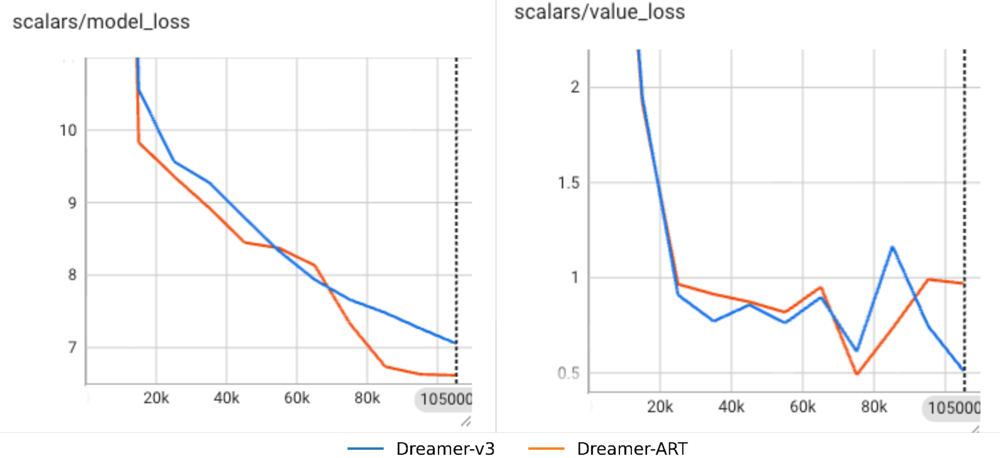

# Dreamer-v3-ART (Adaptive Rollouts Termination)
We proposed a variant of Dreamer-v3, adding a module that allow the actor-critic to learn the imagination with high certanty and ignore the uncertain imagination. The whole repository was built upon [Naoki Morihira's Dreamerv3-torch implementation: https://github.com/NM512/dreamerv3-torch](https://github.com/NM512/dreamerv3-torch) with lightweight modification when world model generating the rollout.

We introduce additional two hyperparameters to control for the threshold of stoping conditions. Those are:

- infoprop_mc_samples: many next-states should be sampled for eact imagination step, in order to measure the eptemistic uncertainty

- infoprop_lambda: threshold of eptemistic uncertainty to stop further generating the imaginations.


## Implementations

Get dependencies with python 3.11:
```
pip install -r requirements.txt
```
Run Original Dreamer-v3 training on DMC Vision:
```
python3 dreamer.py --configs dmc_vision --task dmc_walker_walk --logdir ./logdir/dmc_walker_walk
```

Run Dreamer-ART on DMC:
```
python dreamer.py \                                                                       
  --configs dmc_proprio \
  --task dmc_walker_walk \
  -- use_infoprop_termination True\
  -- infoprop_mc_samples 5\
  -- infoprop_lambda 1e9\
  --logdir ./logdir/walker_infoprop_100k-1129 \

```

Monitor results:
```
tensorboard --logdir ./logdir
```

## Benchmarks
| Environment        | Observation | Action | Budget | Description |
|-------------------|---|---|---|-----------------------|
| [DMC Proprio](https://github.com/deepmind/dm_control) | State | Continuous | 500K | DeepMind Control Suite with low-dimensional inputs. |


## Results
#### DMC Proprio (Walker-Walk)




## Acknowledgments
This code is heavily inspired by the following works:
- danijar's Dreamer-v3 jax implementation: https://github.com/danijar/dreamerv3
- danijar's Dreamer-v2 tensorflow implementation: https://github.com/danijar/dreamerv2
- jsikyoon's Dreamer-v2 pytorch implementation: https://github.com/jsikyoon/dreamer-torch
- RajGhugare19's Dreamer-v2 pytorch implementation: https://github.com/RajGhugare19/dreamerv2
- denisyarats's DrQ-v2 original implementation: https://github.com/facebookresearch/drqv2
- Naoki Morihira's Dreamerv3-torch implementation: https://github.com/NM512/dreamerv3-torch